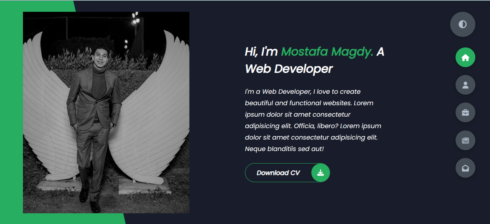

# Portfolio

My portfolio is a collection of My work that showcases My skills and experience. It include projects I’ve worked on.

## 🚀 About Me

I'm a front-End developer...

## 🔗 Links

## 🛠 Skills

HTML, CSS, Git, GitHub, Javascript...

## Portfolio Link

[Portfolio](https://mostafa-m-desouky.github.io/My-Portfolio/)
