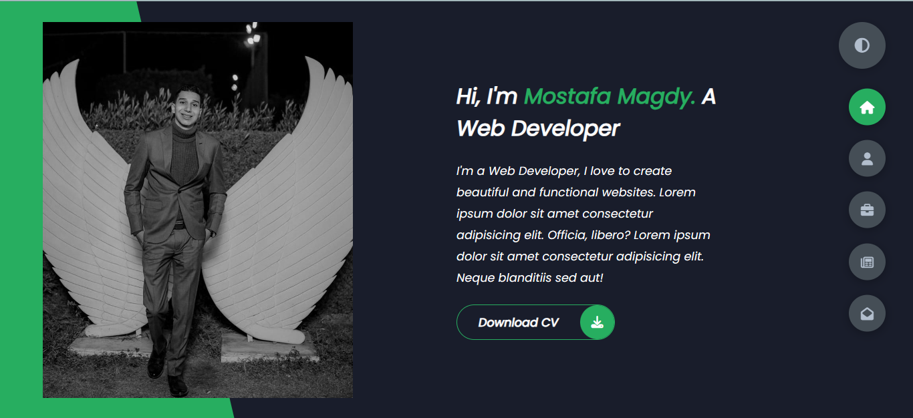

# DevHub | Dynamic Software Engineering Portfolio

A dynamic, responsive, and minimalist personal portfolio designed for software engineers. This platform serves as a central hub to showcase diverse programming accomplishments, from low-level systems in C to modern full-stack web applications. It dynamically categorizes and displays GitHub repositories based on programming languages and domains.

## 🚀 Live Demo
<!-- To Add Photo -->
<!--  -->

🔗 [View Live Project](https://mostafa-m-desouky.github.io/dev-hub/)

## ✨ Key Features
- **Dynamic Project Fetching:** Integrates with GitHub API to pull and display repository data in real-time.
- **Language-based Categorization:** Automatically filters and groups projects (Python, JavaScript, Node.js, C).
- **Architecture-Driven UI:** Custom layout designed with dynamic grids and flexbox tailored for deep tech presentation.
- **Dual Theme Support:** Seamless, high-contrast Dark Mode and Light Mode switching with custom transition effects.
- **Direct Connect:** Quick WhatsApp integration for instant recruitment and freelance inquiries.

## 🛠️ Tech Stack
- **Frontend:** HTML5, CSS3 (Advanced Grid, Flexbox, Custom CSS Variables), JavaScript (ES6+, Event Delegation).
- **Backend/API:** GitHub REST API.

## 💻 Getting Started

To run this project locally, follow these steps:

1. **Clone the repository:**
   ```bash
   git clone [https://github.com/mostafa-m-desouky/dev-hub.git](https://github.com/mostafa-m-desouky/dev-hub.git)


